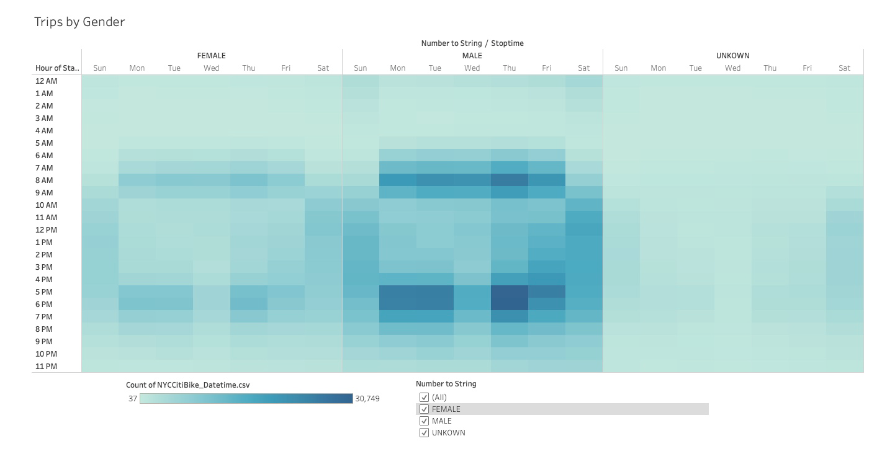

# Bikesharing [Bikesharing Story](https://public.tableau.com/profile/angela.silveira#!/vizhome/CitiBikeChallenge_16029620876140/CitiBikeChallenge?publish=yes "BikeSharing Story")
## Overview
The purpose of this analysis is to explore trends associated with a bikesharing program located in New York City for the month of August in order to better understand if such a program is potentially sustainable in a new market (Des Moines).
## Results
Several trends were graphed into visual aids to capture trends associated with particular factors in the New York City market for the month of August. 
### 1 - Customer Types

A vast majority of bikesharing users in this study were regular subscribers (orange) versus one-time bike users (blue) indicating subscriptions are the integral to success for a bikesharing program versus targeting large volumes of episodic customers.
### 2 - Peak Hours

Based on start time, the peak hours of bikesharing use occured at typical commute times (8am, 4pm-7pm). Mid-day hours accounted for the second highest utilization time while nighttime bikesharing utilization had the lowest volume (10pm-5am).
### 3 - Trip Duration

Further analysis of average trip duration indicates the highest number of rides averaging 4-6 hours. The lowest volume of checkout times occured for rides less than one hour and rides over 21 hours.
### 4 - Weekday Trips

Mapping number of trips by day of the week show a visible difference in weekday trends (more rides around morning/evening commute times) versus weekend trends (more rides late morning-afternoon). Sundays demonstrate the lowest volume of trips.
### 5 - Gender Trips

Mapping trips by customer gender indicates male customers frequent bike sharing more than female customers. Analysis also includes 'unknown' gender.
### 6 - Gender by Weekday

Adding an additional filter for customer type, male subscribers on weekdays (Monday-Friday) are visibly greater utilizers based on number of trips. Female subscribers on weekdays are the second greatest utilizers, while incidental customers of unknown gender demonstrated the most use on weekends.
### 7 - Gender Checkout Times

By further breakdown down trends based on gender and length of bike checkout, peak times for male and female customers are 4-6 hours with the lowest volume of rides being less than 1 hour or more than 22 hours. For male customers, the difference in volume of rides is much more significant than for female customers. Male customer trips of less than 1 hour were less than 400 rides (female customers = ~200 rides), while 5 hour rides were just over 2,000 rides (female customers = ~700 rides).

## Summary
- Based on the above analysis, male subscribers during weekday commutes are the greatest opportunity for a bikesharing program to succeed. The most significant difference between factors is demonstrated in the customer type (majority - subscribers), with the next most significant factors being gender (majority - male customers), and day of week/time of day (majority - weekday commute times). This information would be helpful in considering a new market to ensure that the demographics match these trends. 
### Potential further analysis
- Recognizing the target customers are subscribers during commute times, it is likely there are stations that experience greater borrow/return rates that can be mapped against employers/businesses/housing in the area closest to those stations. Some businesses may employee individuals more likely to pursue a commute with bikesharing (particularly if parking is limited), and customers may be likely to recommend bikesharing to colleagues/neighbors creating clusters of subscribers. Additional analysis of station location and corresponding businesses may be helpful in identifying target customers for a marketing strategy launching in a new market. 
- Additionally, adding the gender/age and customer type trends to a heatmap of station locations may help identify trends associated with commuters versus recreational users. This would be helpful in planning station locations for a new market based on demographics (age/gender) and businesses/tourist attractions (customer types). 
